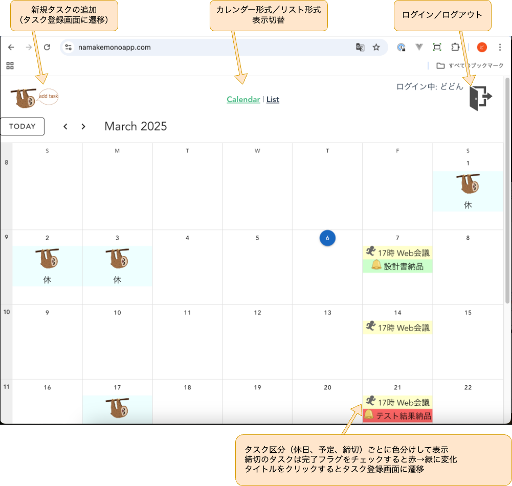
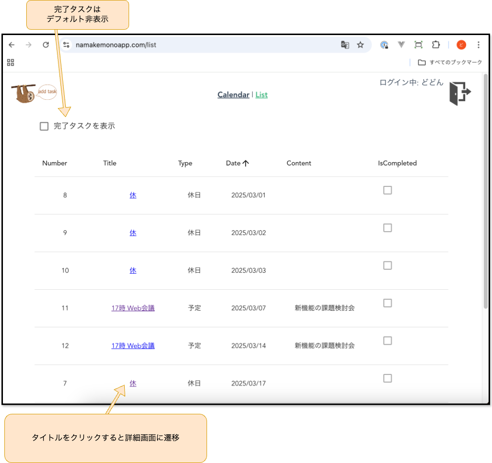
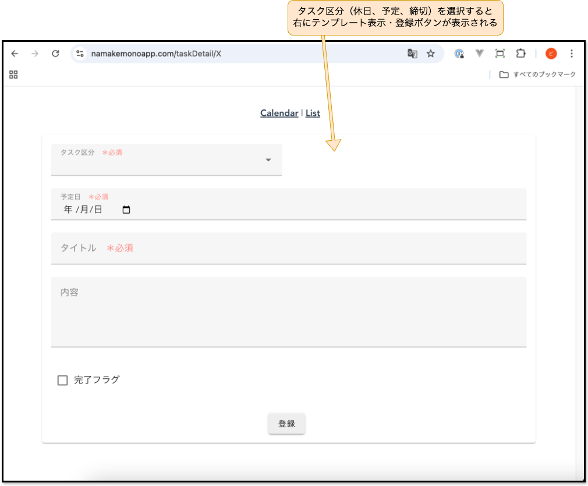
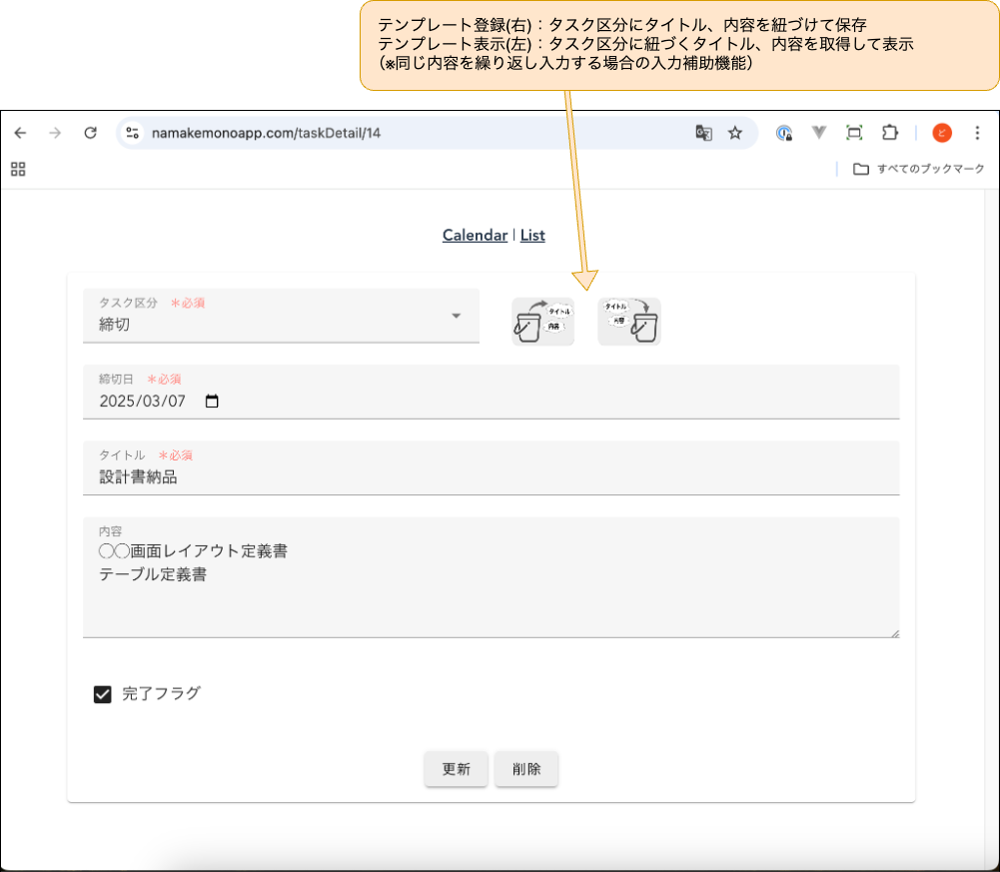
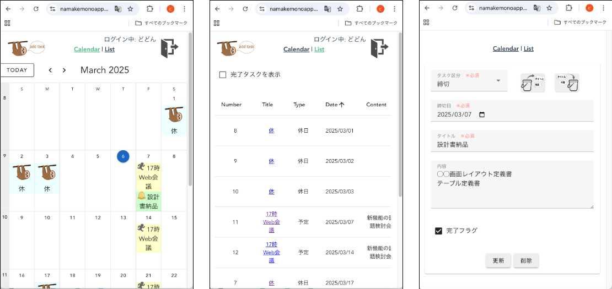
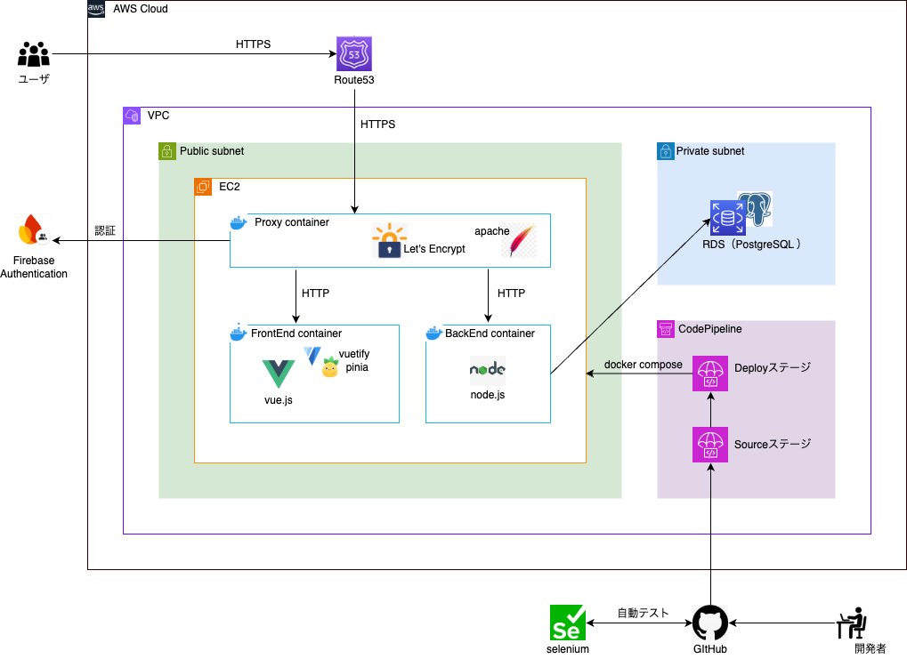
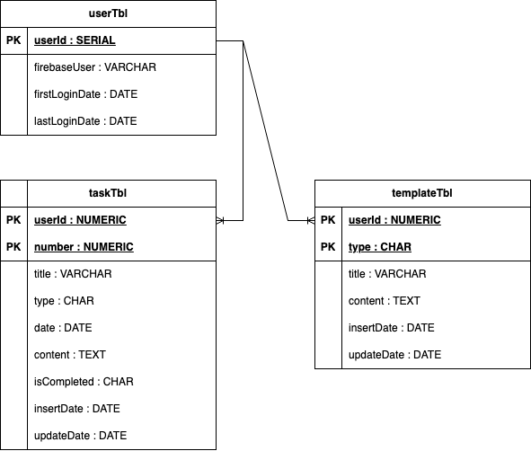

# namakemonoApp
#### - ナマケモノのためのスケジュール＆タスク管理アプリ - 
細かいスケジュール・タスク管理が面倒なナマケモノさんのために、少ないアクションで最低限のタスクの締切、予定を管理するアプリ。<br>
登録できるタスク区分は"休日"、"予定"、"締切"の３種類のみ。<br>
まずは休日を登録して休みを確保した上で、最低限のタスクの締切、打合せ予定を管理しましょう。

## アプリ紹介
### https://namakemonoapp.com

### ①カレンダー画面


### ②リスト画面


### ③タスク登録画面（新規登録）


### ④タスク登録画面（更新・削除）


### スマホサイズ表示


## システム構成図


## 技術要素

#### フロントエンド
| 名称 | 説明 |
| ---- | ---- |
| Vue 3 | フロントエンドフレームワーク |
| Vue-router | SPAのルーティング設定 |
| Vuetify | UIコンポーネント |
| Pinia | 状態管理（複数コンポーネントにわたるリアクティブなデータを管理） |
| Axios | バックエンドへのHTTP通信を行う |
| Firebase Authentication | JWTを用いたログイン・ログアウト |

#### バックエンド
| 名称 | 説明 |
| ---- | ---- |
| Node.js | APIサーバーとして利用 |
| Axios | フロントエンドからのHTTPリクエストにJSON形式のレスポンスを返却する |
| PostgreSQL | データベース |

#### プロキシ
| 名称 | 説明 |
| ---- | ---- |
| Apache | HTTPサーバ |
| Let’s Encrypt | SSL証明書 |

- プロキシコンテナを経由することで常時SSL通信化。外部→プロキシ間はHTTPS通信、プロキシ→フロントエンド／バックエンド間はHTTP通信。


#### インフラ
| 名称 | 説明 |
| ---- | ---- |
| EC2 | 本番用サーバ（Amazon Linux2） |
| RDS | 本番用DB（PostgreSQL） |
| CodePipeline | CI/CD構築 |
| Terraform | 本番用インフラ構築 |
| Docker, Docker-compose | コンテナ構築 |
| Github, GitHub Actions  | バージョン管理・自動テスト |

- AWSの環境構築はTerraformで自動化。

- CodePipelineは、『Sourceステージ => Deployステージ』の順で実行され、SourceステージにてGitHubから引き上げた資源をDeployステージにてdocker-composeを使ってEC2にデプロイします。


#### 自動テスト
| 名称 | 説明 |
| ---- | ---- |
| Selenium | headlessモードでブラウザのGUIの起動なしでWebアプリの自動テストを実施 |

- GitHub ActionsでmainブランチにPullRequest時に自動テストを実施。

## ER図


## ディレクトリ構成図
```
.
├── README.md
├── appspec.yml
├── back
│   ├── Dockerfile
│   └── app
│       ├── app.js
│       ├── routes
│       │   ├── dbConnect.js
│       │   ├── firebase.js
│       │   ├── tasks.js
│       │   └── templates.js
│       └── yarn.lock
├── docker-compose.yml
├── front
│   ├── Dockerfile
│   └── app
│       └── vue-project
│           ├── babel.config.js
│           ├── jsconfig.json
│           ├── package.json
│           ├── public
│           │   ├── favicon.ico
│           │   └── index.html
│           ├── src
│           │   ├── App.vue
│           │   ├── api
│           │   │   ├── taskApi.js
│           │   │   └── templateApi.js
│           │   ├── assets
│           │   │   └── 各種画像ファイルを格納
│           │   ├── components
│           │   │   ├── FirebaseAuth.vue
│           │   │   ├── HomeCalendar.vue
│           │   │   ├── TaskDetail.vue
│           │   │   └── TodoList.vue
│           │   ├── main.js
│           │   ├── plugins
│           │   │   ├── vuetify.js
│           │   │   └── webfontloader.js
│           │   ├── router
│           │   │   └── index.js
│           │   ├── store
│           │   │   ├── authStore.js
│           │   │   ├── index.js
│           │   │   ├── taskStore.js
│           │   │   └── templateStore.js
│           │   └── views
│           │       ├── HomeView.vue
│           │       └── ListView.vue
│           ├── vue.config.js
│           └── yarn.lock
├── proxy
│   └──apache_conf
│       │── certs                      
│       │   └── 各種証明書を格納
│       │── httpd-vhosts.conf
│       └── httpd.conf
├── scripts
│   └── deploy.sh
├── terraform
│   └── 各種.tfファイルを格納
└── tests
    ├── Dockerfile
    ├── package.json
    └── test_schedule.js

```

