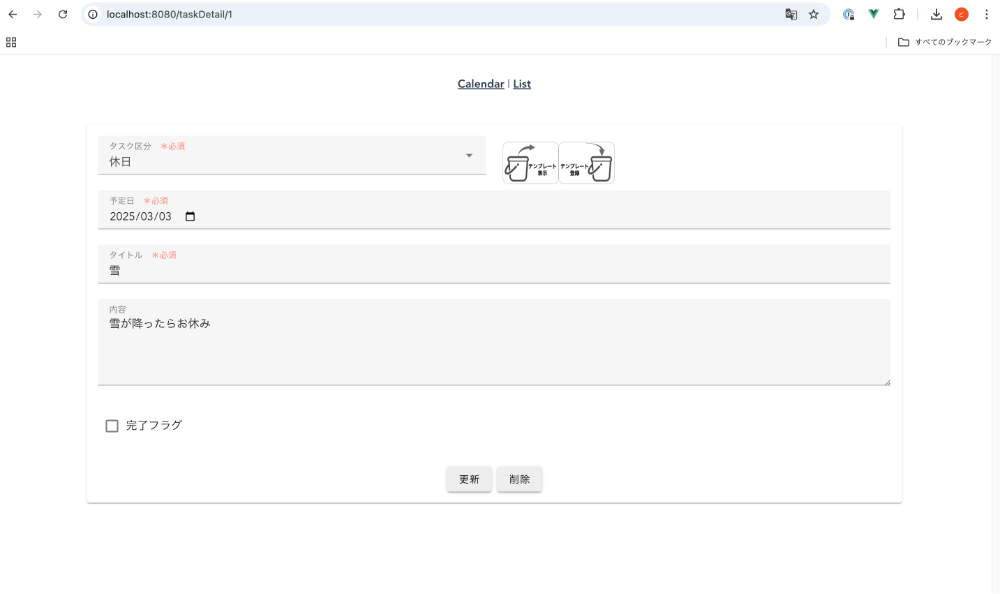

# namakemonoApp
#### - ナマケモノのためのスケジュール＆タスク管理アプリ - 

## アプリ紹介
 
 
 

## システム構成図

## 技術要素

#### フロントエンド
| 名称 | 説明 |
| ---- | ---- |
| Vue 3 | フロントエンドフレームワーク |
| Vuetify | UIコンポーネント |
| Vue-router | xxx |
| Pinia | xxx |
| Axios | xxx |
| Firebase Authentication | JWTを用いたログイン・ログアウト |

- Vuetifyコンポーネントを導入することで、スマホ利用を想定したレスポンシブデザインを実現。

- Vuexストアでステート管理。

- 個人情報（パスワード）は、外部API（Firebase Authentication）に保存する仕組みで、外部APIで発行されるJWTをCookieに保存してログイン・ログアウト機能を実装しました。

#### バックエンド
| 名称 | 説明 |
| ---- | ---- |
| Node.js | APIサーバーとして利用 |
| PostgreSQL | データベース |

- Node.jsはAPIサーバーとして利用しており、フロントエンドコンテナからのリクエストに対してJSONデータを返しています。

- その他のデータはRDSに保存。

- 個人情報（ログインパスワード）は外部API（Firebase Authentication）にのみ保存しており、RDSには保存されません。

#### インフラ
| 名称 | 説明 |
| ---- | ---- |
| EC2 | 本番用サーバ（Amazon Linux2） |
| RDS | 本番用DB（PostgreSQL） |
| CodePipeline | CI/CD構築 |
| Terraform | 本番用インフラ構築 |
| Docker, Docker-compose | コンテナ構築 |
| Github, GitHub Actions  | バージョン管理・自動テスト |

- ローカル開発環境からデプロイまで一貫してDockerを使用。

- プロキシコンテナを経由することで常時SSL通信化。

- CodePipelineは、『Sourceステージ => Deployステージ』の順で実行され、SourceステージにてGitHubから引き上げた資源をDeployステージにてdocker-composeを使ってEC2にデプロイします。

#### 自動テスト
| 名称 | 説明 |
| ---- | ---- |
| Selenium | headlessモードでブラウザのGUIの起動なしでWebアプリの自動テストを実施 |

- GitHub ActionsでmainブランチにPullRequest時に実行されます。

