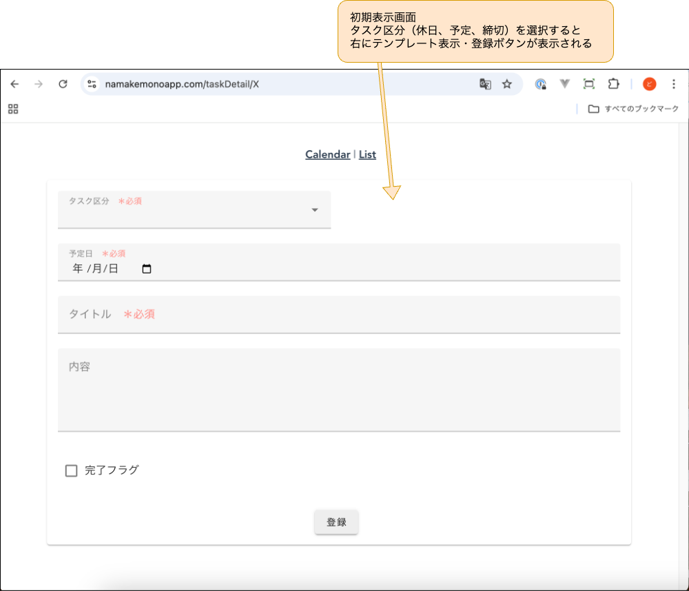
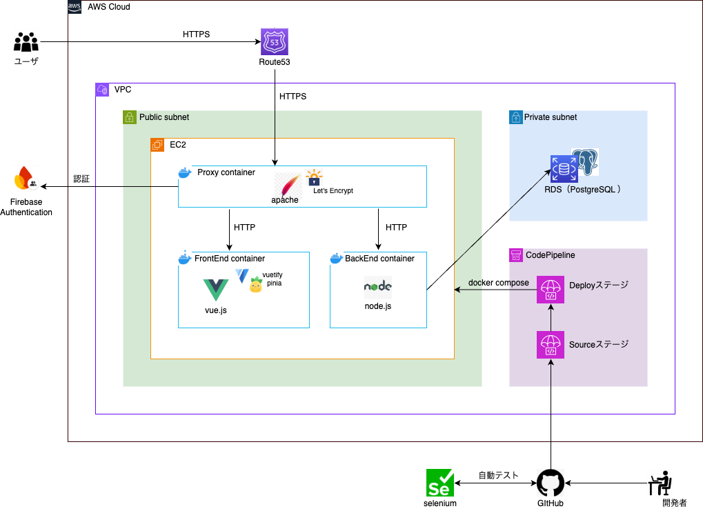

# namakemonoApp
#### - ナマケモノのためのスケジュール＆タスク管理アプリ - 
細かいスケジュール・タスク管理が面倒なナマケモノさんのために最低限のタスクの締切、予定を管理するアプリ 

## アプリ紹介
### https://namakemonoapp.com

### ①カレンダー画面

### ②リスト画面

### ③タスク登録画面（更新・削除）

### ④タスク登録画面（新規登録）

### スマホサイズ表示

## システム構成図

## 技術要素

#### フロントエンド
| 名称 | 説明 |
| ---- | ---- |
| Vue 3 | フロントエンドフレームワーク |
| Vue-router | SPAのルーティング設定 |
| Vuetify | UIコンポーネント |
| Pinia | 状態管理（複数コンポーネントにわたるリアクティブなデータを管理） |
| Axios | バックエンドへのHTTP通信を行う |
| Firebase Authentication | JWTを用いたログイン・ログアウト |

#### バックエンド
| 名称 | 説明 |
| ---- | ---- |
| Node.js | APIサーバーとして利用 |
| Express | Node.jsのフレームワーク |
| Axios | フロントエンドからのHTTPリクエストにJSON形式のレスポンスを返却する |
| PostgreSQL | データベース |

#### プロキシ
| 名称 | 説明 |
| ---- | ---- |
| Apache | HTTPサーバ |
| Let’s Encrypt | SSL証明書 |

- プロキシコンテナを経由することで常時SSL通信化。外部→プロキシ間はHTTPS通信、プロキシ→フロントエンド／バックエンド間はHTTP通信。

#### インフラ
| 名称 | 説明 |
| ---- | ---- |
| EC2 | 本番用サーバ（Amazon Linux2） |
| RDS | 本番用DB（PostgreSQL） |
| CodePipeline | CI/CD構築 |
| Terraform | 本番用インフラ構築 |
| Docker, Docker-compose | コンテナ構築 |
| Github, GitHub Actions  | バージョン管理・自動テスト |

- AWSの環境構築はTerraformで自動化。

- CodePipelineは、『Sourceステージ => Deployステージ』の順で実行され、SourceステージにてGitHubから引き上げた資源をDeployステージにてdocker-composeを使ってEC2にデプロイします。

#### 自動テスト
| 名称 | 説明 |
| ---- | ---- |
| Selenium | headlessモードでブラウザのGUIの起動なしでWebアプリの自動テストを実施 |

- GitHub ActionsでmainブランチにPullRequest時に自動テストを実施。

## ER図

